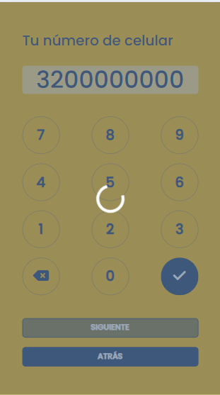
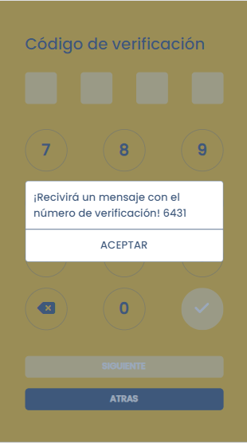
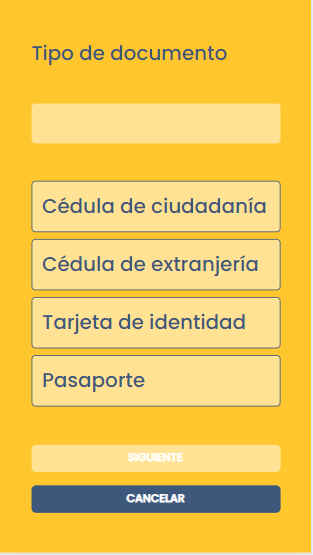
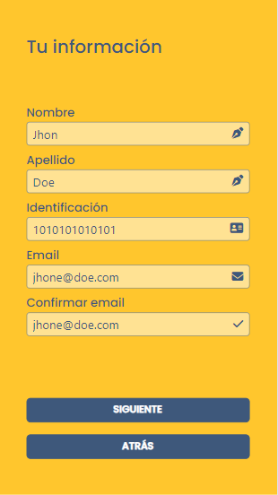
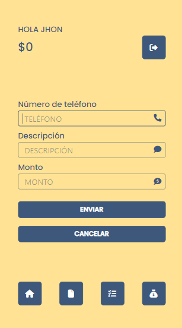
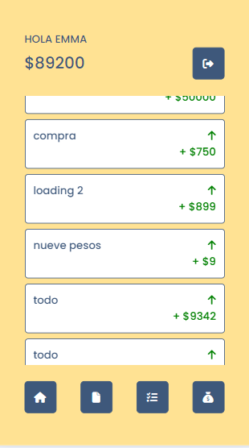

# mycoincapp
Aplicación para tener un monedero o alcancia digital.

Esta aplicación permite a los usuarios guardar y transferir dinero usando sus números de teléfono. Está construida utilizando Angular para el frontend y Express en Node.js para el backend, con MongoDB como sistema de base de datos.

## Características

- **Registro y autenticación de usuarios**: Los usuarios pueden registrarse e iniciar sesión.
- **Gestión de cuentas**: Los usuarios pueden agregar y visualizar su saldo de dinero.
- **Transferencias**: Los usuarios pueden transferir dinero a otros usuarios mediante el número de teléfono.
- **Historial de transacciones**: Los usuarios pueden ver un historial de todas sus operaciones realizadas.

## Tecnologías Utilizadas

- **Frontend**: Angular 16.2.12
- **Backend**: Node.js 20.11.1 con Express
- **Base de Datos**: MongoDB

## Configuración del Proyecto

### Prerrequisitos

Asegúrate de tener instalado Node.js (v20.11.1 o superior) y npm. También necesitarás MongoDB corriendo localmente o una instancia remota configurada.

### Instalación

1. **Clonar el repositorio**

   ```bash
   git clone https://github.com/tu-usuario/money-transfer-app.git
   ```

### Ejecutar la aplicación

#### Backend

Para iniciar el servidor de backend en modo de desarrollo, usa el siguiente comando desde el directorio del backend:

```bash
npm run dev
```

on anterioridad se debe tener la ruta a la base de datos MongoDB.

#### Frontend

Para iniciar el servidor de frontend en modo de desarrollo, usa el siguiente comando desde el directorio del frontend:

```bash
ng serve -o
```

La aplicaión se abrirá en http://localhost:4200/

### Diseño orientado a dispositivos móviles

La interfaz de usuario de esta aplicación ha sido diseñada para dispositivos móviles.


### Capturas de pantalla 

<!-- Fila 1 con 5 imágenes -->
    

<!-- Fila 2 con 5 imágenes -->
    


